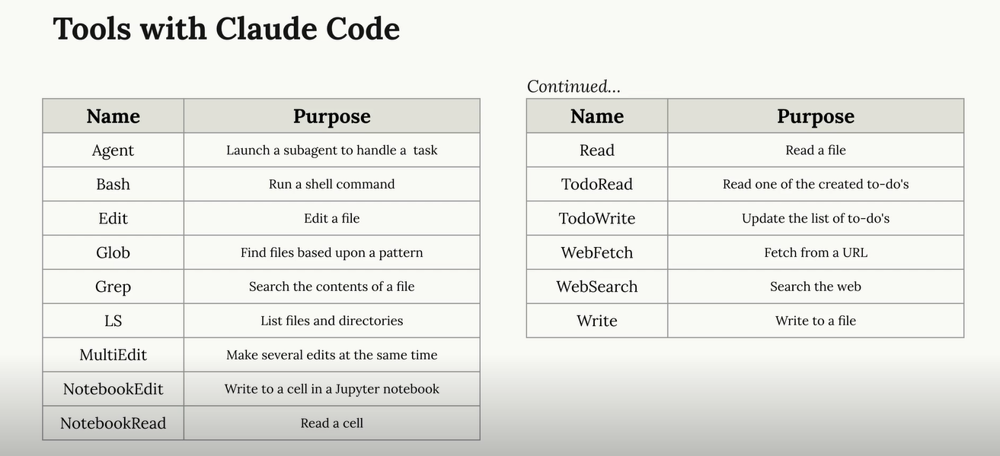

# Claude Code

Claude Code is an AI agent designed to help developers understand and work with codebases more efficiently. It can read, edit, and write code, as well as execute commands and interact with various tools to assist you in your development workflow.



## Most Used Claude Commands

```bash

claude

/usage - Shows the usage

/init - Initialize a new CLAUDE.md file with codebase documentation.

(Pound sign: #)  => Memory mode, allows you to save information in memory for later retrieval.
for example:

# The database schema is defined in the @prisma/schema.prisma file. Reference it anytime you need to understand the structure of data stored in the database.

# Use comments sparingly. Only comment complex code

/model - Shows the current model being used by Claude, and select which one to use for different tasks.

Escape - Interrupt Claude allowing to redirect or correct it.

/compact - Summarizes the conversation history, keeping only the most relevant information to maintain context while freeing up memory for new information.

/clear - Clears the conversation history, allowing you to start fresh without any previous context.

ALT+V paste in an image into the Claude console (or drag and drop it)

Esc Esc : Rewind the conversation to a previous point, allowing you to go back and change the direction of the conversation or correct any mistakes.
```

## CLAUDE.md file

Guides Claude through your codebase, pointing out:

- Important commands
- Architecture
- Coding style

Allows you to give Claude specific or custom directions.

Different versions of CLAUDE.md:

- CLAUDE.md : Generated with /init, commit to source control and shared with the team.
- CLAUDE.local.md : Personal version of CLAUDE.md, not committed to source control, for your own notes and directions to Claude.
- ~/.claude/CLAUDE.md : Global version of CLAUDE.md, not committed to source control, for general directions to Claude across all projects.

## Useful Prompts

## Custom Commands

## Planning Mode

To enable planning mode hit `SHIFT+Tab` twice You have a complex task that requires multiple steps. You want Claude to break it down into smaller, manageable steps and execute them one by one. When Plan mode is enabled, Claude can only read files and plans, no edits until you approve.

## Thinking Mode

'Think' | 'Think more' | 'Think a lot' | 'Think longer' | 'Ultrathink'

Planning and Thinking can be used together. When you want Claude to think more about a plan, you can use the 'Think' commands to have it iterate on the plan and come up with better solutions.

## MCP Servers

What are MCP servers and how to use them with Claude?

**Playwright:**

Run the following command `claude mcp add playwright --scope project cmd /c  npx  @playwright/mcp@latest` in your terminal to install the Playwright MCP server for your project.

```bash


Open the app in the browser and iterate on the styling a few times. Go for a sleek modern design with a dark theme. Do not change the Color Palette. Use the same colors but in a more modern way. Make sure to use the colors in the palette and not add any new colors. Do not change the layout of the app, just make it look better with a sleek modern design and a dark theme.
```

## Hooks

Run a command before (PreToolUse hook) or after (PostToolUse hook) Claude does something to automate tasks and improve your workflow.

Examples:

- Run a code formatter after Claude edits a file
- Stop Claude from editing or reading a particular file
- Check for TODO comments in code that Claude writes and add them to a log file
- Run tests automatically after a file is changed
- Block file edits that add variables that don't follow the naming convention
- Block deprecated function usage in code that Claude writes

### Building a Hook

1. Decide on the trigger: PreToolUse or PostToolUse
2. Determine which type of Tool calls you want to watch for
   (Read, Edit, Write, Bash, Glob, Grep, Task, WebFetch, WebSearch)

   tip: List out the name of all the tools you have access to, bullet point list.

3. Write a command that will receive the tool call
4. If needed, command should provide feedback to Claude.

## Subagents

Subagents are a powerful way to automate complex tasks that require multiple steps and decision-making.
They allow you to create a sequence of actions that Claude can execute autonomously, based on the goals you set.

- subagents have their own isolated context window
- subagents can be highly specialized for specific tasks
- subagents can run in parallel to handle multiple tasks at once
- subagents work with a limited set of tools to ensure they stay focused on their specific task

**Unit Tester Subagent**: A subagent that automatically generates unit tests for your codebase. You can set it up to run after every code change, ensuring that your code is always well-tested and that any issues are caught early.

**Security Auditor Subagent**: A subagent that scans your codebase for security vulnerabilities. It can be configured to run on a regular schedule or after specific events, such as code commits or pull requests.

**Documentation Subagent**: A subagent that generates and updates documentation for your codebase. It can analyze your code and create documentation based on the structure and comments, ensuring that your documentation is always up-to-date.

**UX Reviewer Subagent**: A subagent that reviews the user experience of your application. It can analyze user interactions, gather feedback, and suggest improvements to enhance the overall user experience.

**Code Quality Reviewer Subagent**: A subagent that reviews the quality of your code. It can analyze code for best practices, maintainability, and adherence to coding standards, providing feedback and suggestions for improvement.
