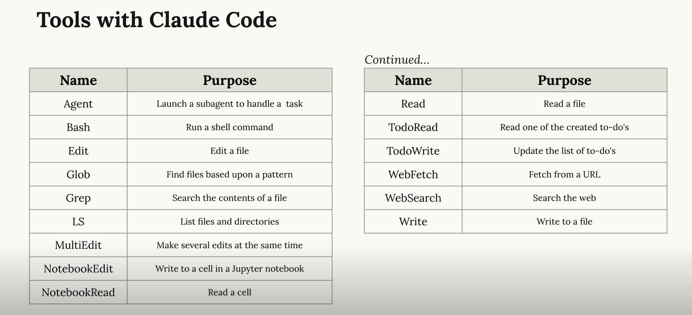
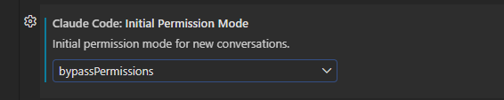

# Claude Code

Claude Code is an AI agent designed to help developers understand and work with codebases more efficiently. It can read, edit, and write code, as well as execute commands and interact with various tools to assist you in your development workflow.



## Most Used Claude Commands

```bash

claude

/usage - Shows the usage

/init - Initialize a new CLAUDE.md file with codebase documentation.

(Pound sign: #)  => Memory mode, allows you to save information in memory for later retrieval.
for example:

# The database schema is defined in the @prisma/schema.prisma file. Reference it anytime you need to understand the structure of data stored in the database.

# Use comments sparingly. Only comment complex code

/model - Shows the current model being used by Claude, and select which one to use for different tasks.

Escape - Interrupt Claude allowing to redirect or correct it.

/compact - Summarizes the conversation history, keeping only the most relevant information to maintain context while freeing up memory for new information.

/clear - Clears the conversation history, allowing you to start fresh without any previous context.

ALT+V paste in an image into the Claude console (or drag and drop it)

Esc Esc : Rewind the conversation to a previous point, allowing you to go back and change the direction of the conversation or correct any mistakes.
```

## CLAUDE.md file

CLAUDE.md is a markdown file that serves as a guide for Claude to understand your codebase, project structure, and any specific instructions or conventions you want it to follow. It is loaded into Claude's context when you start a conversation, allowing it to reference the information and instructions you have provided.

Guides Claude through your codebase, pointing out:

- Important commands
- Architecture
- Coding style

`/init` - Initializes a new CLAUDE.md file with codebase documentation. This command will prompt you with questions about your project and generate a CLAUDE.md file based on your answers. You can then edit and customize the file as needed to provide more specific instructions or information for Claude.

Different versions of CLAUDE.md:

- CLAUDE.md : Generated with /init, commit to source control and shared with the team.
- CLAUDE.local.md : Personal version of CLAUDE.md, not committed to source control, for your own notes and directions to Claude.
- ~/.claude/CLAUDE.md : Global version of CLAUDE.md, not committed to source control, for general directions to Claude across all projects.

## Useful Prompts

## Skills

Skills are reusable commands that you can create for Claude to perform specific tasks.
They can be simple one-liners or complex multi-step processes. Once created, you can call a skill anytime in the conversation to have Claude execute it.

## Custom Commands

## Managing Context

When Claude's context window is full, it can lose track of important information from earlier in the conversation. Context Rot is a technique to help mitigate this issue by allowing you to summarize and condense the conversation history, keeping only the most relevant information while freeing up memory for new information.

Useful commands for managing context:

- `/compact` - Summarizes the conversation history, keeping only the most relevant information to maintain context while freeing up memory for new information.
- `/clear` - Clears the conversation history, allowing you to start fresh without any previous context
- `/rewind` - Rewind the conversation to a previous point, allowing you to go back and change the direction of the conversation or correct any mistakes.
- `/context` - View the current conversation context, including all relevant information and details that Claude is currently aware of.

Auto-compaction: Claude will automatically summarize the conversation history when it reaches a certain threshold, ensuring that it always has enough memory to work with new information while retaining the most important context.

## Permission Modes

### Plan Mode

Claude can analyze and propose changes, but cannot execute anything. Read-only mode for planning and analysis.

### Accept Edits

Claude can read, write and edit files without asking.
Still asks permission for Bash/shell commands

### Bypass Permissions

Claude can read, write and edit files and execute Bash/shell commands without asking. Full autonomy. Use with caution.

## Planning Mode

To enable planning mode hit `SHIFT+Tab` twice You have a complex task that requires multiple steps. You want Claude to break it down into smaller, manageable steps and execute them one by one. When Plan mode is enabled, Claude can only read files and plans, no edits until you approve.

## Thinking Mode

'Think' | 'Think more' | 'Think a lot' | 'Think longer' | 'Ultrathink'

Planning and Thinking can be used together. When you want Claude to think more about a plan, you can use the 'Think' commands to have it iterate on the plan and come up with better solutions.

## MCP Servers

What are MCP servers and how to use them with Claude?

**Playwright:**

Run the following command `claude mcp add playwright --scope project cmd /c  npx  @playwright/mcp@latest` in your terminal to install the Playwright MCP server for your project.

```bash


Open the app in the browser and iterate on the styling a few times. Go for a sleek modern design with a dark theme. Do not change the Color Palette. Use the same colors but in a more modern way. Make sure to use the colors in the palette and not add any new colors. Do not change the layout of the app, just make it look better with a sleek modern design and a dark theme.
```

## Hooks

Run a command before (PreToolUse hook) or after (PostToolUse hook) Claude does something to automate tasks and improve your workflow.

Examples:

- Run a code formatter after Claude edits a file
- Stop Claude from editing or reading a particular file
- Check for TODO comments in code that Claude writes and add them to a log file
- Run tests automatically after a file is changed
- Block file edits that add variables that don't follow the naming convention
- Block deprecated function usage in code that Claude writes

### Building a Hook

1. Decide on the trigger: PreToolUse or PostToolUse
2. Determine which type of Tool calls you want to watch for
   (Read, Edit, Write, Bash, Glob, Grep, Task, WebFetch, WebSearch)

   tip: List out the name of all the tools you have access to, bullet point list.

3. Write a command that will receive the tool call
4. If needed, command should provide feedback to Claude.

## Subagents

Subagents are a powerful way to automate complex tasks that require multiple steps and decision-making.
They allow you to create a sequence of actions that Claude can execute autonomously, based on the goals you set.

- subagents have their own isolated context window
- subagents can be highly specialized for specific tasks
- subagents can run in parallel to handle multiple tasks at once
- subagents work with a limited set of tools to ensure they stay focused on their specific task

**Unit Tester Subagent**: A subagent that automatically generates unit tests for your codebase. You can set it up to run after every code change, ensuring that your code is always well-tested and that any issues are caught early.

**Security Auditor Subagent**: A subagent that scans your codebase for security vulnerabilities. It can be configured to run on a regular schedule or after specific events, such as code commits or pull requests.

**Documentation Subagent**: A subagent that generates and updates documentation for your codebase. It can analyze your code and create documentation based on the structure and comments, ensuring that your documentation is always up-to-date.

**UX Reviewer Subagent**: A subagent that reviews the user experience of your application. It can analyze user interactions, gather feedback, and suggest improvements to enhance the overall user experience.

**Code Quality Reviewer Subagent**: A subagent that reviews the quality of your code. It can analyze code for best practices, maintainability, and adherence to coding standards, providing feedback and suggestions for improvement.

## Plugins

What are Plugins?

Plugins are extensions that add new features or enhance existing functionality in Claude. They allow you to customize and extend Claude's capabilities to better suit your workflow and specific needs.
Examples of Plugins:

- **GitHub Plugin**: Integrates GitHub with Claude, allowing you to manage issues, pull requests, and repositories directly from the Claude interface.
- **Jira Plugin**: Connects Jira to Claude, enabling you to create, update, and track Jira issues without leaving the Claude environment.
- **CI/CD Plugin**: Integrates with your CI/CD pipeline, allowing you to monitor

```bash

claude plugin uninstall <plugin-name>
claude plugin remove <plugin-name>
claude plugin list — see all installed plugins
claude plugin disable <plugin-name> — disable without uninstalling
claude plugin enable <plugin-name> — re-enable a disabled plugin

```

How to install the Frontend Design Plugin from Anthropic's Plugin Store:

```bash
/plugin marketplace add anthropics/claude-code
/plugin install frontend-design@claude-code-plugin

```

## Initial Permission Mode

The **Initial Permission Mode** setting controls how Claude handles tool permissions at the start of each new conversation.

Setting it to `bypassPermissions` means Claude will automatically allow all tool calls without prompting for approval — useful for trusted local workflows where you want uninterrupted automation.



## WAT Framework

**Agent**: The AI entity that executes the workflows and interacts with tools to accomplish tasks.

**Workflows**: Markdown SOPs that define the steps and tools needed to accomplish a task. They are stored in the `workflows/` directory and serve as the instructions for the AI agent.

**Tools**: Python scripts that perform specific functions, such as making API calls or processing data. They are stored in the `tools/` directory and are executed by the AI agent based on the instructions defined in the workflows.

## Agentic Workflows

Agentic workflows are a powerful way to automate complex tasks that require multiple steps and decision-making. They allow you to create a sequence of actions that Claude can execute autonomously, based on the goals you set. Agentic workflows that can perform a wide range of functions, from data analysis to customer support.

Examples of Agentic Workflows:

- **Automated Code Review Workflow**: Claude can analyze a pull request, identify potential issues, suggest improvements, and even make changes to the codebase autonomously.
- **Automated Testing Workflow**: Claude can run tests, analyze results, and make adjustments to the code or tests as needed to ensure that everything is working correctly.
- **Automated Deployment Workflow**: Claude can handle the entire deployment process, from building and testing to deploying and monitoring the application in production.
- **Automated Bug Fixing Workflow**: Claude can identify bugs in the code, analyze the root cause, and implement fixes autonomously, while keeping you informed of the changes being made.
- **Automated Feature Development Workflow**: Claude can take a feature request, break it down into smaller tasks, and implement the feature autonomously, while keeping you updated on the progress and any decisions being made.
- **Automated Refactoring Workflow**: Claude can analyze the codebase for areas that could benefit from refactoring, suggest improvements, and make changes autonomously to improve code quality and maintainability.

**WAT** stands for "Workflow Automation Tool" and is a framework for building agentic workflows. It allows you to define a series of steps that an AI agent can execute to achieve a specific goal. Each step can involve different actions, such as making API calls, processing data, or interacting with users.  

**A2A** stands for "Agent-to-Agent" communication, which is a key aspect of agentic workflows. It enables different AI agents to communicate and collaborate with each other to accomplish tasks that may require multiple skills or expertise. This allows for more complex and efficient workflows, as agents can share information and delegate tasks to each other as needed.

## Tools and Platforms

**Trigger.dev**: A platform that provides tools and resources for building and deploying agentic workflows. It offers a range of features, including a visual workflow builder, pre-built templates, and integration with various AI models and APIs. With Trigger.dev, you can easily create and manage your agentic workflows, allowing you to automate tasks and processes in a more efficient and scalable way.

**Modal**: AI infrastructure provider that allows you to run AI models in the cloud. It provides a simple interface for deploying and managing AI models, making it easier for developers to integrate AI capabilities into their applications. Modal offers features such as auto-scaling, monitoring, and logging, which help ensure that your AI models run smoothly and efficiently. With Modal, you can focus on building your applications while they handle the complexities of AI infrastructure.

**Vercel**: A cloud platform for static sites and serverless functions. It provides a seamless experience for deploying and hosting web applications, making it an ideal choice for developers looking to quickly get their projects online. Vercel offers features such as automatic scaling, global CDN, and easy integration with popular frameworks like Next.js. With Vercel, you can focus on building your application while they handle the deployment and hosting aspects.

**Perplexity**: An AI platform that provides access to powerful language models, including Claude. It offers a range of tools and resources for developers to build and deploy AI-powered applications. With Perplexity, you can easily integrate AI capabilities into your projects, allowing you to create more intelligent and responsive applications.

**Tavily**: Connect AI Agents to the web. Real-time search, extraction and web crawling through a single secure API. Tavily allows you to access and interact with web data in real-time, making it easier to build AI applications that require up-to-date information from the web.

**FireCrawl**: An AI-powered web crawling and data extraction tool. It allows you to easily gather and analyze data from websites, making it easier to build AI applications that require web data.

**NanoBanana**: Nano Banana is an advanced AI image editing model that has quickly gained attention for its exceptional prompt understanding, consistent character editing, and scene preservation.Experience the future of AI image editing.

**Key**: [Key](https://key.ai/) helps communities unlock their potential. It offers a unique approach to creating meaningful professional connections and fostering career development, financial wellbeing and work-life balance.

**Serper**: An AI-powered search engine that provides real-time access to information from the web. It allows you to quickly find relevant information and insights, making it easier to build AI applications that require up-to-date data.

## RAG - Retrieval-Augmented Generation

Retrieval-Augmented Generation (RAG) is a technique that enables large language models (LLMs) to retrieve and incorporate new information from external data sources.[1] With RAG,


